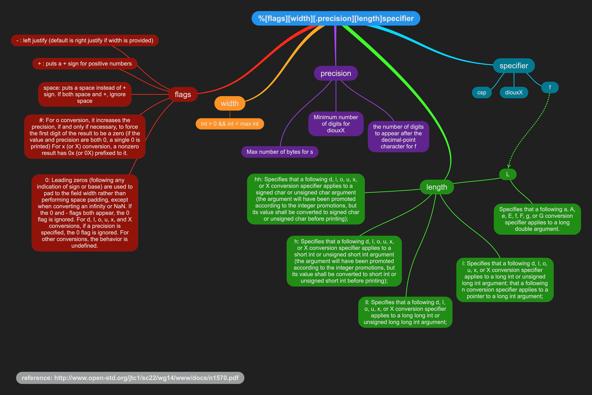

# ft_printf
Recoding printf function from the standard C library.

## Description
This is the first project of the algorithms branch of Hive Helsinki coding school.
Allowed funcitons to use: write, malloc, free, exit and functions of stdarg.
The prototype is:
```
int  ft_printf(char *format, ...)
```
Each conversion specification is introduced by the character % like this:
```
%[flags][width][.precision][length]specifier
```
For this project my main reference was [International Standard ISO/IEC 9899](https://www.open-std.org/jtc1/sc22/wg14/www/docs/n1570.pdf), and I prepared format guide for myself based on this standard, where you can see which conversion specifiers and flags were implemented for ft_printf:


